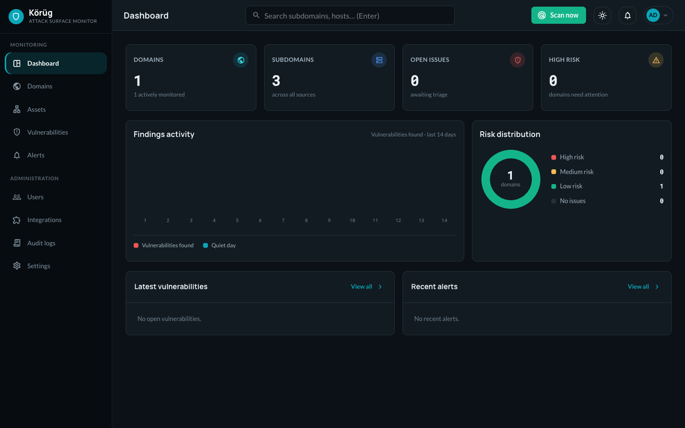

<h1 align="center">𐰚𐰘𐰺𐰈𐰏 Körüg</h1>

<p align="center">
    Subdomain discovery, takeover detection, and continuous monitoring
</p>

# Overview

Körüg (Old Turkic for "protection/guardian") automates subdomain discovery and takeover vulnerability detection. It enumerates subdomains across multiple sources, scores takeover risk, and surfaces findings through a web dashboard, REST API, and CLI — with Slack and email alerts when something needs attention.

All dashboards reflect real scan data: charts, alerts, and statistics are computed from your own scans, not seeded samples.

<p align="center">
    
</p>

# Features

**Passive discovery**
- Aggregates subdomains from many free, no-key sources — crt.sh, HackerTarget, CertSpotter, RapidDNS, AlienVault OTX, ThreatMiner, Wayback, BufferOver, ThreatCrowd
- Optional key-gated sources: VirusTotal, SecurityTrails, BinaryEdge, Censys, urlscan, Shodan; plus local Subfinder (Amass opt-in via `ENABLE_AMASS`)
- Per-source attribution; every source is best-effort so one failure never fails a scan

**Enrichment & detection**
- DNS resolution to IPs, with subdomains classified by shared IP
- HTTP(S) probing with smart https→http fallback: status code, final URL, title, content-length, server
- Technology fingerprinting and Cloudflare detection
- Optional port scan (nmap with service/version when available, else built-in TCP scan)
- Subdomain takeover detection — unclaimed S3 buckets, orphaned CNAME / MX / NS — with per-finding confidence scoring
- Automatic CVE lookup (NVD) for new/changed live hosts, using fingerprinted product+version
- Certificate Transparency monitoring via crt.sh — issuer, validity, SANs per host

**Continuous attack-surface monitoring**
- Every scheduled scan diffs the surface against the last and records each change
- Tracks new, removed, and reappeared subdomains; live/offline, IP, tech, and port shifts; and newly-issued certificates
- A **Changes** activity feed plus automatic alerts on significant changes
- Disappeared hosts are flagged (kept for history), never silently dropped

**Dashboard**
- Redesigned React UI — dark sidebar app shell, light/dark theme toggle, and a global search
- Overview: domain / subdomain / open-issue / high-risk stat cards, a 14-day findings timeline, a risk-distribution donut, and panels for the latest vulnerabilities and recent alerts
- Domains: searchable, sortable list with a per-domain risk roll-up; add or remove domains and drill into any one
- Domain detail: discovered subdomains with DNS records, source attribution, live/orphan/gone status, sort + filter, and on-demand rescan — every row is clickable
- Subdomain detail: a per-host page with DNS records, fingerprint, open ports, vulnerabilities, certificates, and a change timeline; rescan or refresh certs on demand
- Assets: one clickable, sortable/filterable view of every subdomain across all domains (including gone hosts)
- Changes: the attack-surface activity feed — new/removed hosts, status/IP/tech/port shifts, new certificates — sortable and filterable
- Vulnerabilities: search, type/status filters, confidence scoring, and one-click false-positive flagging
- Sort and filter on every list view
- Settings: one tabbed page for your profile & password, discovery-source API keys, Slack notifications, and scan preferences
- Live scan-status indicator in the sidebar while a discovery is running

**Alerts & notifications**
- In-app security alerts raised automatically from scan findings
- Slack notifications — configurable and testable from **Settings → Integrations**; email (SMTP) alerts via the API

**Access control & administration**
- JWT authentication with `admin` / `viewer` roles
- Self-service profile and password changes from **Settings → Profile**
- User management (create users, change roles, enable/disable, reset passwords) via the REST API and CLI
- Discovery-source API keys managed in **Settings → API keys**; programmatic access keys via the API
- Persistent audit log of security-relevant actions

**Automation & reporting**
- Scheduled scans
- REST API with Swagger documentation and a companion CLI
- CSV / JSON / XLSX export

# Installation

```bash
git clone https://github.com/mfksec/korug.git
cd korug
cp docker/.env.docker docker/.env   # Docker config; set JWT_SECRET_KEY, API_KEY, DB credentials
docker compose -f docker/docker-compose.yml up -d --build
```

> Use `--build` (and `--build` again when updating) so Docker doesn't reuse a stale cached image.

Dashboard: http://localhost:3000 | API docs: http://localhost:8000/docs

On first run an initial `admin` account is created. If `ADMIN_PASSWORD` is not set, a strong random password is generated and printed to the logs once — capture it and change it after logging in.

> Configure secrets via environment variables, never in committed files. See [.env.example](.env.example) for all options. Slack notifications are configured at runtime from the dashboard's **Settings → Integrations** tab.

# Documentation

- [Quick Start](docs/QUICKSTART.md)
- [User Guide](docs/USER_GUIDE.md)
- [API Reference](docs/API.md)
- [CLI Reference](docs/CLI.md)
- [Authentication](docs/AUTH.md)
- [Architecture](docs/ARCHITECTURE.md)

<p align="center">
    <a href="LICENSE">
        
    </a>
    <a href="https://github.com/mfksec/korug">
        
    </a>
</p>
